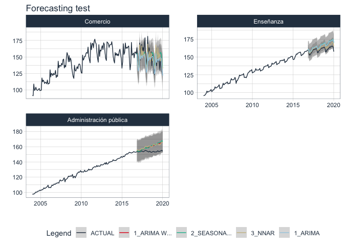
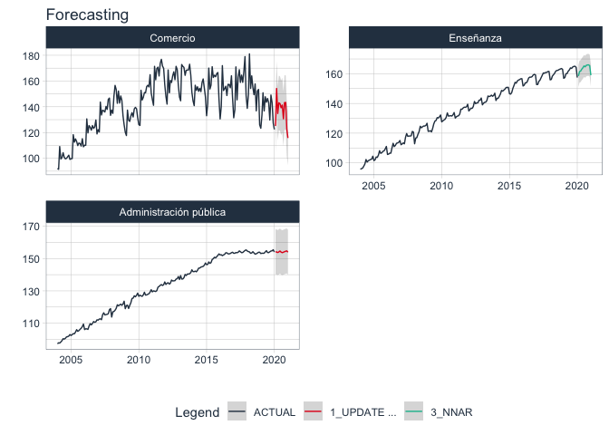

<!-- README.md is generated from README.Rmd. Please edit that file -->

# sknifedatar :package: “Swiss Knife of Data for R” 

<!-- badges: start -->

[](https://CRAN.R-project.org/package=sknifedatar)
[](https://cran.r-project.org/package=sknifedatar)


<!-- badges: end -->

> Serves primarily as an extension to the
> [modeltime](https://business-science.github.io/modeltime/) :package:
> ecosystem. In addition to some functionalities of spatial data and
> visualization.

## Installation

CRAN version:

``` r
install.packages("sknifedatar")
```

Or install the development version from GitHub with:

``` r
# install.packages("devtools")
devtools::install_github("rafzamb/sknifedatar")
```

## Features:  

-   multifit: multiple models into multiple time series (no panel).
-   workflowsets: [worklowset over a time
    series](https://rafzamb.github.io/sknifedatar/articles/workflowsets_times.html).
-   workflowset multifit: [worklowset over multiple time series (no
    panel)](https://rafzamb.github.io/sknifedatar/articles/workflowsets_multi_times.html).
-   automagic tabs: [automatic generation of Tabs in Distill/Rmarkdown
    files](https://rafzamb.github.io/sknifedatar/articles/automatic_tabs.html).
-   sliding windows: [data partitioning in sliding
    windows](https://rafzamb.github.io/sknifedatar/articles/sliding_windows.html).

## Usage

### Fit multiple models into multiple time series.


### libraries

``` r
 library(modeltime)
 library(rsample)
 library(parsnip)
 library(recipes)
 library(workflows)
 library(dplyr)
 library(tidyr)
 library(sknifedatar)
```

### Data

``` r
data("emae_series")
nested_serie = emae_series %>% filter(date < '2020-02-01') %>% nest(nested_column=-sector)
 
nested_serie
#> # A tibble: 16 x 2
#>    sector                           nested_column     
#>    <chr>                            <list>            
#>  1 Comercio                         <tibble [193 × 2]>
#>  2 Ensenanza                        <tibble [193 × 2]>
#>  3 Administracion publica           <tibble [193 × 2]>
#>  4 Transporte y comunicaciones      <tibble [193 × 2]>
#>  5 Servicios sociales/Salud         <tibble [193 × 2]>
#>  6 Impuestos netos                  <tibble [193 × 2]>
#>  7 Sector financiero                <tibble [193 × 2]>
#>  8 Mineria                          <tibble [193 × 2]>
#>  9 Agro/Ganaderia/Caza/Silvicultura <tibble [193 × 2]>
#> 10 Electricidad/Gas/Agua            <tibble [193 × 2]>
#> 11 Hoteles/Restaurantes             <tibble [193 × 2]>
#> 12 Inmobiliarias                    <tibble [193 × 2]>
#> 13 Otras actividades                <tibble [193 × 2]>
#> 14 Pesca                            <tibble [193 × 2]>
#> 15 Industria manufacturera          <tibble [193 × 2]>
#> 16 Construccion                     <tibble [193 × 2]>
```

### Recipes

``` r
recipe_1 = recipe(value ~ ., data = emae_series %>% select(-sector)) %>%
  step_date(date, features = c("month", "quarter", "year"), ordinal = TRUE)
```

### Models

``` r
 m_auto_arima <- arima_reg() %>% set_engine('auto_arima')

 m_stlm_arima <- seasonal_reg() %>%
   set_engine("stlm_arima")

 m_nnetar <- workflow() %>%
   add_recipe(recipe_1) %>%
   add_model(nnetar_reg() %>% set_engine("nnetar"))
```

### modeltime\_multifit()

``` r
 model_table_emae <- modeltime_multifit(serie = nested_serie %>% head(3),
                                       .prop = 0.8,
                                       m_auto_arima,
                                       m_stlm_arima,
                                       m_nnetar)
#> Registered S3 method overwritten by 'tune':
#>   method                   from   
#>   required_pkgs.model_spec parsnip
#> frequency = 12 observations per 1 year
#> frequency = 12 observations per 1 year
#> frequency = 12 observations per 1 year
#> frequency = 12 observations per 1 year
#> frequency = 12 observations per 1 year
#> frequency = 12 observations per 1 year
#> frequency = 12 observations per 1 year
#> frequency = 12 observations per 1 year
#> frequency = 12 observations per 1 year
#> 
#> ── 3 models fitted ♥ ───────────────────────────────────────────────────────────

 model_table_emae
#> $table_time
#> # A tibble: 3 x 7
#>   sector       nested_column   m_auto_arima m_stlm_arima m_nnetar nested_model  
#>   <chr>        <list>          <list>       <list>       <list>   <list>        
#> 1 Comercio     <tibble [193 ×… <fit[+]>     <fit[+]>     <workfl… <model_time […
#> 2 Ensenanza    <tibble [193 ×… <fit[+]>     <fit[+]>     <workfl… <model_time […
#> 3 Administrac… <tibble [193 ×… <fit[+]>     <fit[+]>     <workfl… <model_time […
#> # … with 1 more variable: calibration <list>
#> 
#> $models_accuracy
#> # A tibble: 9 x 10
#>   name_serie  .model_id .model_desc  .type   mae  mape   mase smape  rmse    rsq
#>   <chr>           <int> <chr>        <chr> <dbl> <dbl>  <dbl> <dbl> <dbl>  <dbl>
#> 1 Comercio            1 ARIMA(0,1,1… Test   8.54  5.55  0.656  5.69 10.7  0.588 
#> 2 Comercio            2 SEASONAL DE… Test   9.33  6.28  0.717  6.24 11.2  0.415 
#> 3 Comercio            3 NNAR(1,1,10… Test   9.71  6.36  0.746  6.52 11.5  0.510 
#> 4 Ensenanza           1 ARIMA(1,1,1… Test   5.38  3.35  3.90   3.28  6.00 0.730 
#> 5 Ensenanza           2 SEASONAL DE… Test   5.56  3.46  4.03   3.38  6.21 0.726 
#> 6 Ensenanza           3 NNAR(1,1,10… Test   2.73  1.70  1.98   1.69  3.05 0.874 
#> 7 Administra…         1 ARIMA(0,1,1… Test   6.10  3.96 12.6    3.86  7.05 0.0384
#> 8 Administra…         2 SEASONAL DE… Test   6.45  4.19 13.4    4.07  7.61 0.0480
#> 9 Administra…         3 NNAR(1,1,10… Test   6.26  4.07 13.0    3.97  6.88 0.0524
```

### modeltime\_multiforecast()

``` r
forecast_emae <- modeltime_multiforecast(
  model_table_emae$table_time,
  .prop = 0.8
)
```

``` r
forecast_emae %>% 
  select(sector, nested_forecast) %>% 
  unnest(nested_forecast) %>% 
  group_by(sector) %>% 
  plot_modeltime_forecast(
    .legend_max_width = 12,
    .facet_ncol = 2, 
    .line_size = 0.5,
    .interactive = FALSE,
    .facet_scales = 'free_y',
    .title='Forecasting test') 
```



### modeltime\_multibestmodel()

``` r
best_model_emae <- modeltime_multibestmodel(
    .table = model_table_emae$table_time,
    .metric = "rmse",
    .minimize = TRUE,
    .forecast = FALSE
  )

best_model_emae
#> # A tibble: 3 x 8
#>   sector       nested_column   m_auto_arima m_stlm_arima m_nnetar nested_model  
#>   <chr>        <list>          <list>       <list>       <list>   <list>        
#> 1 Comercio     <tibble [193 ×… <fit[+]>     <fit[+]>     <workfl… <model_time […
#> 2 Ensenanza    <tibble [193 ×… <fit[+]>     <fit[+]>     <workfl… <model_time […
#> 3 Administrac… <tibble [193 ×… <fit[+]>     <fit[+]>     <workfl… <model_time […
#> # … with 2 more variables: calibration <list>, best_model <list>
```

### modeltime\_multirefit()

``` r
model_refit_emae <- modeltime_multirefit(models_table = best_model_emae)
#> frequency = 12 observations per 1 year
#> frequency = 12 observations per 1 year
#> frequency = 12 observations per 1 year

model_refit_emae
#> # A tibble: 3 x 8
#>   sector       nested_column   m_auto_arima m_stlm_arima m_nnetar nested_model  
#>   <chr>        <list>          <list>       <list>       <list>   <list>        
#> 1 Comercio     <tibble [193 ×… <fit[+]>     <fit[+]>     <workfl… <model_time […
#> 2 Ensenanza    <tibble [193 ×… <fit[+]>     <fit[+]>     <workfl… <model_time […
#> 3 Administrac… <tibble [193 ×… <fit[+]>     <fit[+]>     <workfl… <model_time […
#> # … with 2 more variables: calibration <list>, best_model <list>
```

``` r
forecast_emae <- modeltime_multiforecast(
    model_refit_emae,
    .prop = 0.8,
    .h = "1 years"
)
```

``` r
forecast_emae %>% 
  select(sector, nested_forecast) %>% 
  unnest(nested_forecast) %>% 
  group_by(sector) %>% 
  plot_modeltime_forecast(
    .legend_max_width = 12,
    .facet_ncol = 2, 
    .line_size = 0.5,
    .interactive = FALSE,
    .facet_scales = 'free_y',
    .title='Forecasting'
    ) 
```



## Others functions :cyclone:

### 🔹 Function multieval()

For a set of predictions from different models, it allows you to
evaluate multiple metrics and return the results in a tabular format
that makes it easy to compare the predictions.

``` r
library(yardstick)
library(erer)

set.seed(123)
predictions =
  data.frame(truth = runif(100),
             predict_model_1 = rnorm(100, mean = 1,sd =2),
             predict_model_2 = rnorm(100, mean = 0,sd =2))

tibble(predictions)
#> # A tibble: 100 x 3
#>     truth predict_model_1 predict_model_2
#>     <dbl>           <dbl>           <dbl>
#>  1 0.288            1.51            1.58 
#>  2 0.788            0.943           1.54 
#>  3 0.409            0.914           0.664
#>  4 0.883            3.74           -2.02 
#>  5 0.940            0.548          -0.239
#>  6 0.0456           4.03           -0.561
#>  7 0.528           -2.10            1.13 
#>  8 0.892            2.17           -0.745
#>  9 0.551            1.25            1.95 
#> 10 0.457            1.43           -0.749
#> # … with 90 more rows
```

``` r
multieval(.dataset = predictions,
          .observed = "truth",
          .predictions = c("predict_model_1","predict_model_2"),
          .metrics = listn(rmse, rsq, mae))
#> $summary_table
#> # A tibble: 2 x 4
#>   modelo           rmse      rsq   mae
#>   <chr>           <dbl>    <dbl> <dbl>
#> 1 predict_model_1  1.99 0.000704  1.59
#> 2 predict_model_2  1.95 0.00115   1.61
```

### 🔹 Function insert\_na()

This function allows adding NA values to a data frame, being able to
select the columns and the proportion of NAs desired.

``` r
insert_na(.dataset = iris, columns = c("Sepal.Length","Petal.Length"), .p = 0.25)
#> # A tibble: 150 x 5
#>    Sepal.Width Petal.Width Species Sepal.Length Petal.Length
#>          <dbl>       <dbl> <fct>          <dbl>        <dbl>
#>  1         3.5         0.2 setosa           5.1         NA  
#>  2         3           0.2 setosa          NA            1.4
#>  3         3.2         0.2 setosa           4.7          1.3
#>  4         3.1         0.2 setosa          NA            1.5
#>  5         3.6         0.2 setosa          NA            1.4
#>  6         3.9         0.4 setosa           5.4          1.7
#>  7         3.4         0.3 setosa           4.6          1.4
#>  8         3.4         0.2 setosa          NA            1.5
#>  9         2.9         0.2 setosa           4.4          1.4
#> 10         3.1         0.1 setosa           4.9          1.5
#> # … with 140 more rows
```

## Website

[sknifedatar website](https://rafzamb.github.io/sknifedatar/)
