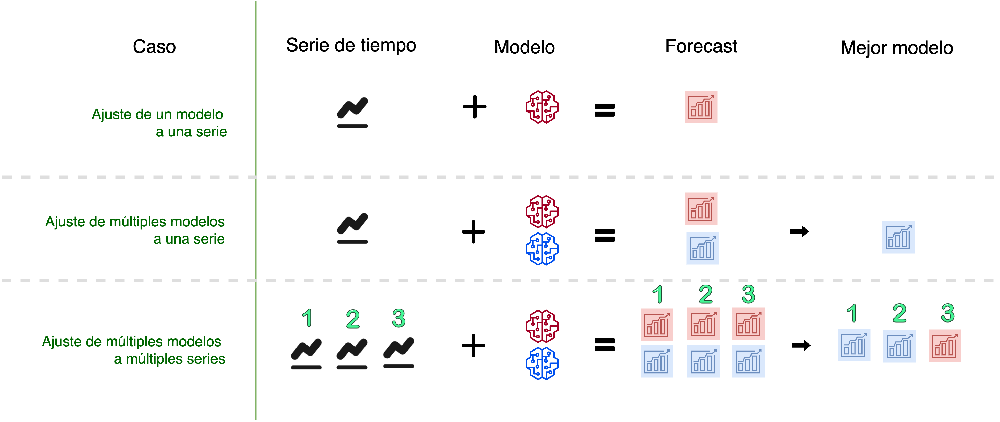

<!-- README.md is generated from README.Rmd. Please edit that file -->

# sknifedatar 📦 “Swiss Knife of Data for R” 

sknifedatar is a package that serves primarily as an extension to the
[modeltime](https://business-science.github.io/modeltime/) 📦 ecosystem.
In addition to some functionalities of spatial data and visualization.

## Installation

Not on CRAN yet.

``` r
#install.packages("sknifedatar")
```

Or install the development version from GitHub with:

``` r
# install.packages("devtools")
devtools::install_github("rafzamb/sknifedatar")
```

## Usage

### Multiple models on multiple series functions



### libraries

``` r
 library(modeltime)
 library(rsample)
 library(parsnip)
 library(recipes)
 library(workflows)
 library(dplyr)
 library(tidyr)
 library(sknifedatar)
```

### Data

``` r
 data("emae_series")
 nested_serie = emae_series %>% filter(date < '2020-02-01') %>% nest(nested_column=-sector)
 
  nested_serie
#> # A tibble: 16 x 2
#>    sector                           nested_column     
#>    <chr>                            <list>            
#>  1 Comercio                         <tibble [193 × 2]>
#>  2 Enseñanza                        <tibble [193 × 2]>
#>  3 Administración pública           <tibble [193 × 2]>
#>  4 Transporte y comunicaciones      <tibble [193 × 2]>
#>  5 Servicios sociales/Salud         <tibble [193 × 2]>
#>  6 Impuestos netos                  <tibble [193 × 2]>
#>  7 Sector financiero                <tibble [193 × 2]>
#>  8 Minería                          <tibble [193 × 2]>
#>  9 Agro/Ganadería/Caza/Silvicultura <tibble [193 × 2]>
#> 10 Electricidad/Gas/Agua            <tibble [193 × 2]>
#> 11 Hoteles/Restaurantes             <tibble [193 × 2]>
#> 12 Inmobiliarias                    <tibble [193 × 2]>
#> 13 Otras actividades                <tibble [193 × 2]>
#> 14 Pesca                            <tibble [193 × 2]>
#> 15 Industria manufacturera          <tibble [193 × 2]>
#> 16 Construcción                     <tibble [193 × 2]>
```

### Recipes

``` r
 recipe_1 = recipe(value ~ ., data = emae_series %>% select(-sector)) %>%
 step_date(date, features = c("month", "quarter", "year"), ordinal = TRUE)
```

### Models

``` r
 m_auto_arima <- arima_reg() %>% set_engine('auto_arima')

 m_stlm_arima <- seasonal_reg() %>%
   set_engine("stlm_arima")

 m_nnetar <- workflow() %>%
   add_recipe(recipe_1) %>%
   add_model(nnetar_reg() %>% set_engine("nnetar"))
```

### modeltime\_multifit

``` r
 model_table_emae = modeltime_multifit(serie = nested_serie %>% head(3),
                                       .prop = 0.8,
                                       m_auto_arima,
                                       m_stlm_arima,
                                       m_nnetar)
#> frequency = 12 observations per 1 year
#> frequency = 12 observations per 1 year
#> frequency = 12 observations per 1 year
#> frequency = 12 observations per 1 year
#> frequency = 12 observations per 1 year
#> frequency = 12 observations per 1 year
#> frequency = 12 observations per 1 year
#> frequency = 12 observations per 1 year
#> frequency = 12 observations per 1 year

 model_table_emae
#> $table_time
#> # A tibble: 3 x 7
#>   sector       nested_column   m_auto_arima m_stlm_arima m_nnetar nested_model  
#>   <chr>        <list>          <list>       <list>       <list>   <list>        
#> 1 Comercio     <tibble [193 ×… <fit[+]>     <fit[+]>     <workfl… <model_time […
#> 2 Enseñanza    <tibble [193 ×… <fit[+]>     <fit[+]>     <workfl… <model_time […
#> 3 Administrac… <tibble [193 ×… <fit[+]>     <fit[+]>     <workfl… <model_time […
#> # … with 1 more variable: calibration <list>
#> 
#> $models_accuracy
#> # A tibble: 9 x 10
#>   name_serie  .model_id .model_desc .type   mae  mape   mase smape  rmse     rsq
#>   <chr>           <int> <chr>       <chr> <dbl> <dbl>  <dbl> <dbl> <dbl>   <dbl>
#> 1 Comercio            1 ARIMA(0,1,… Test  11.9   8.70  1.10   8.41 15.0  1.53e-4
#> 2 Comercio            2 SEASONAL D… Test  12.5   9.24  1.16   8.75 15.7  1.01e-4
#> 3 Comercio            3 NNAR(1,1,1… Test   8.00  5.80  0.743  5.64  8.97 4.79e-1
#> 4 Enseñanza           1 ARIMA(1,1,… Test   3.65  2.27  2.80   2.26  4.27 8.08e-2
#> 5 Enseñanza           2 SEASONAL D… Test   3.67  2.28  2.82   2.28  4.29 7.80e-2
#> 6 Enseñanza           3 NNAR(1,1,1… Test   4.79  2.96  3.68   2.92  5.06 5.88e-1
#> 7 Administra…         1 ARIMA(0,1,… Test   3.23  2.10  6.28   2.07  3.59 3.43e-1
#> 8 Administra…         2 SEASONAL D… Test   3.09  2.01  6.00   1.98  3.56 2.84e-1
#> 9 Administra…         3 NNAR(1,1,1… Test  10.1   6.54 19.6    6.33 10.2  1.90e-2
```

## Website

[sknifedatar website](https://rafzamb.github.io/sknifedatar/)
