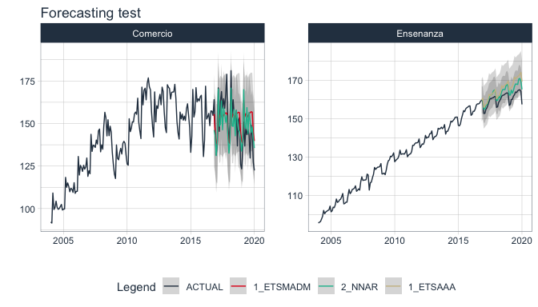
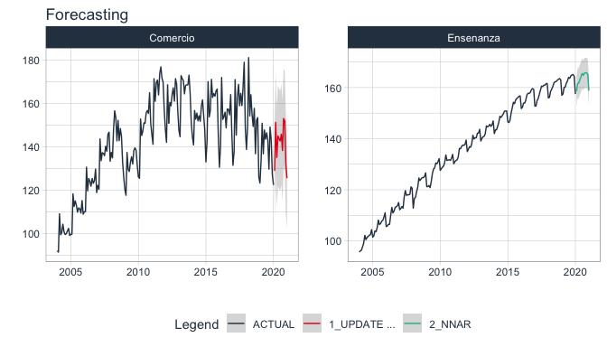

# **sknifedatar** 📦 “Swiss Knife of Data” 

<!-- badges: start -->

[](https://CRAN.R-project.org/package=sknifedatar)
[](https://cran.r-project.org/package=sknifedatar)

<!-- badges: end -->

> Serves primarily as an extension to the
> [modeltime](https://business-science.github.io/modeltime/) 📦
> ecosystem. In addition to some functionalities of spatial data and
> visualization.

## Installation

CRAN version:

``` r
install.packages("sknifedatar")
```

Or install the development version from GitHub with:

``` r
# install.packages("devtools")
devtools::install_github("rafzamb/sknifedatar")
```

## Features:

-   multifit: multiple models into multiple time series (no panel).
-   workflowsets: [worklowset over a time
    series](https:/rafzamb.github.io/sknifedatar/articles/workflowsets_times.html).
-   workflowset multifit: [worklowset over multiple time series (no
    panel)](https:/rafzamb.github.io/sknifedatar/articles/workflowsets_multi_times.html).
-   automagic tabs: [automatic generation of Tabs in Distill/Rmarkdown
    files](https://rafzamb.github.io/sknifedatar/articles/automatic_tabs.html).
-   sliding windows: [data partitioning in sliding
    windows](https://rafzamb.github.io/sknifedatar/articles/sliding_windows.html).

### Multiple models on multiple series functions 📈


-   libraries

``` r
 library(modeltime)
 library(rsample)
 library(parsnip)
 library(recipes)
 library(workflows)
 library(dplyr)
 library(tidyr)
 library(sknifedatar)
```

-   Data

``` r
 data("emae_series")
 nested_serie = emae_series %>% filter(date < '2020-02-01') %>% nest(nested_column=-sector)
 
  nested_serie
#> # A tibble: 16 x 2
#>    sector                           nested_column     
#>    <chr>                            <list>            
#>  1 Comercio                         <tibble [193 × 2]>
#>  2 Ensenanza                        <tibble [193 × 2]>
#>  3 Administracion publica           <tibble [193 × 2]>
#>  4 Transporte y comunicaciones      <tibble [193 × 2]>
#>  5 Servicios sociales/Salud         <tibble [193 × 2]>
#>  6 Impuestos netos                  <tibble [193 × 2]>
#>  7 Sector financiero                <tibble [193 × 2]>
#>  8 Mineria                          <tibble [193 × 2]>
#>  9 Agro/Ganaderia/Caza/Silvicultura <tibble [193 × 2]>
#> 10 Electricidad/Gas/Agua            <tibble [193 × 2]>
#> 11 Hoteles/Restaurantes             <tibble [193 × 2]>
#> 12 Inmobiliarias                    <tibble [193 × 2]>
#> 13 Otras actividades                <tibble [193 × 2]>
#> 14 Pesca                            <tibble [193 × 2]>
#> 15 Industria manufacturera          <tibble [193 × 2]>
#> 16 Construccion                     <tibble [193 × 2]>
```

-   Recipes

``` r
 recipe_1 = recipe(value ~ ., data = emae_series %>% select(-sector)) %>%
 step_date(date, features = c("month", "quarter", "year"), ordinal = TRUE)
```

-   Models

``` r
 m_ets <- workflow() %>%
   add_model(exp_smoothing() %>% set_engine('ets')) %>%
   add_recipe(recipe_1)

 m_nnetar <- workflow() %>%
   add_recipe(recipe_1) %>%
   add_model(nnetar_reg() %>% set_engine("nnetar"))
```

#### 🔺 modeltime\_multifit

``` r
model_table_emae = modeltime_multifit(serie = nested_serie %>% head(2),
                                     .prop = 0.8,
                                     m_ets,
                                     m_nnetar)

 model_table_emae
#> $table_time
#> # A tibble: 2 x 6
#>   sector   nested_column    m_ets    m_nnetar  nested_model     calibration     
#>   <chr>    <list>           <list>   <list>    <list>           <list>          
#> 1 Comercio <tibble [193 × … <workfl… <workflo… <model_time [2 … <model_time [2 …
#> 2 Ensenan… <tibble [193 × … <workfl… <workflo… <model_time [2 … <model_time [2 …
#> 
#> $models_accuracy
#> # A tibble: 4 x 10
#>   name_serie .model_id .model_desc     .type   mae  mape  mase smape  rmse   rsq
#>   <chr>          <int> <chr>           <chr> <dbl> <dbl> <dbl> <dbl> <dbl> <dbl>
#> 1 Comercio           1 ETS(M,AD,M)     Test   9.69  6.66 0.745  6.50 11.7  0.407
#> 2 Comercio           2 NNAR(1,1,10)[1… Test  10.3   6.73 0.793  6.97 12.5  0.433
#> 3 Ensenanza          1 ETS(A,A,A)      Test   4.99  3.11 3.62   3.05  5.63 0.732
#> 4 Ensenanza          2 NNAR(1,1,10)[1… Test   2.67  1.67 1.94   1.65  3.00 0.868
```

### 🔺 modeltime\_multiforecast

``` r
forecast_emae <- modeltime_multiforecast(
  model_table_emae$table_time,
  .prop = 0.8
)
```

``` r
forecast_emae %>% 
  select(sector, nested_forecast) %>% 
  unnest(nested_forecast) %>% 
  group_by(sector) %>% 
  plot_modeltime_forecast(
    .legend_max_width = 12,
    .facet_ncol = 2, 
    .line_size = 0.5,
    .interactive = FALSE,
    .facet_scales = 'free_y',
    .title='Forecasting test') 
```



### 🔺 modeltime\_multibestmodel

``` r
best_model_emae <- modeltime_multibestmodel(
    .table = model_table_emae$table_time,
    .metric = "rmse",
    .minimize = TRUE,
    .forecast = FALSE
  )

best_model_emae
#> # A tibble: 2 x 7
#>   sector  nested_column   m_ets   m_nnetar nested_model  calibration  best_model
#>   <chr>   <list>          <list>  <list>   <list>        <list>       <list>    
#> 1 Comerc… <tibble [193 ×… <workf… <workfl… <model_time … <model_time… <int [1]> 
#> 2 Ensena… <tibble [193 ×… <workf… <workfl… <model_time … <model_time… <int [1]>
```

### 🔺 modeltime\_multirefit

``` r
model_refit_emae <- modeltime_multirefit(models_table = best_model_emae)

model_refit_emae
#> # A tibble: 2 x 7
#>   sector  nested_column   m_ets   m_nnetar nested_model  calibration  best_model
#>   <chr>   <list>          <list>  <list>   <list>        <list>       <list>    
#> 1 Comerc… <tibble [193 ×… <workf… <workfl… <model_time … <model_time… <int [1]> 
#> 2 Ensena… <tibble [193 ×… <workf… <workfl… <model_time … <model_time… <int [1]>
```

``` r
forecast_emae <- modeltime_multiforecast(
    model_refit_emae,
    .prop = 0.8,
    .h = "1 years"
)
```

``` r
forecast_emae %>% 
  select(sector, nested_forecast) %>% 
  unnest(nested_forecast) %>% 
  group_by(sector) %>% 
  plot_modeltime_forecast(
    .legend_max_width = 12,
    .facet_ncol = 2, 
    .line_size = 0.5,
    .interactive = FALSE,
    .facet_scales = 'free_y',
    .title='Forecasting'
    ) 
```



### Others functions 🌀

#### 🔹 Function multieval

For a set of predictions from different models, it allows you to
evaluate multiple metrics and return the results in a tabular format
that makes it easy to compare the predictions.

``` r
library(yardstick)
library(erer)

set.seed(123)
predictions =
  data.frame(truth = runif(100),
             predict_model_1 = rnorm(100, mean = 1,sd =2),
             predict_model_2 = rnorm(100, mean = 0,sd =2))

tibble(predictions)
#> # A tibble: 100 x 3
#>     truth predict_model_1 predict_model_2
#>     <dbl>           <dbl>           <dbl>
#>  1 0.288            1.51            1.58 
#>  2 0.788            0.943           1.54 
#>  3 0.409            0.914           0.664
#>  4 0.883            3.74           -2.02 
#>  5 0.940            0.548          -0.239
#>  6 0.0456           4.03           -0.561
#>  7 0.528           -2.10            1.13 
#>  8 0.892            2.17           -0.745
#>  9 0.551            1.25            1.95 
#> 10 0.457            1.43           -0.749
#> # … with 90 more rows
```

``` r
multieval(.dataset = predictions,
          .observed = "truth",
          .predictions = c("predict_model_1","predict_model_2"),
          .metrics = listn(rmse, rsq, mae))
#> $summary_table
#> # A tibble: 2 x 4
#>   modelo           rmse      rsq   mae
#>   <chr>           <dbl>    <dbl> <dbl>
#> 1 predict_model_1  1.99 0.000704  1.59
#> 2 predict_model_2  1.95 0.00115   1.61
```

#### 🔹 Function insert\_na

This function allows adding NA values to a data frame, being able to
select the columns and the proportion of NAs desired.

``` r
insert_na(.dataset = iris, columns = c("Sepal.Length","Petal.Length"), .p = 0.25)
#> # A tibble: 150 x 5
#>    Sepal.Width Petal.Width Species Sepal.Length Petal.Length
#>          <dbl>       <dbl> <fct>          <dbl>        <dbl>
#>  1         3.5         0.2 setosa           5.1         NA  
#>  2         3           0.2 setosa          NA            1.4
#>  3         3.2         0.2 setosa           4.7          1.3
#>  4         3.1         0.2 setosa          NA            1.5
#>  5         3.6         0.2 setosa          NA            1.4
#>  6         3.9         0.4 setosa           5.4          1.7
#>  7         3.4         0.3 setosa           4.6          1.4
#>  8         3.4         0.2 setosa          NA            1.5
#>  9         2.9         0.2 setosa           4.4          1.4
#> 10         3.1         0.1 setosa           4.9          1.5
#> # … with 140 more rows
```

## Use cases

To consult projects where this package was used, visit:

-   [Blog Posts / Rafael
    Zambrano](https://rafael-zambrano-blog-ds.netlify.app/blog.html)
-   [Blog Posts / Karina
    Bartolome](https://karbartolome-blog.netlify.app/)

the logo icon was developed by
[OpenClipart-Vectors](https://pixabay.com/es/users/openclipart-vectors-30363/?utm_source=link-attribution&utm_medium=referral&utm_campaign=image&utm_content=154314)
